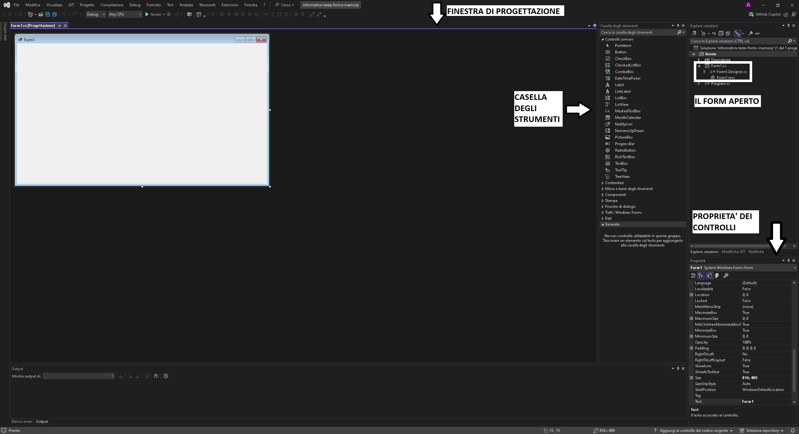

# Informatica - Classi Terze - Windows Forms - Lezione 1 (Memory)

In questa lezione andremo a creare il gioco del memory come da registrazione presente al percorso `assets/recording.mp4` di questa lezione.

# Windows Forms

Windows Forms è una libreria di classi grafica inclusa nel .NET Frawork e .NET Core di Microsoft, utilizzata per creare applicazioni desktop con interfaccia grafica utente (GUI) per il sistema operativo Windows. 

Fornisce un'ampia gamma di controlli, come pulsanti, caselle di testo, etichette e altri elementi grafici, che possono essere facilmente trascinati e rilasciati in un designer visivo all'interno dell'ambiente di sviluppo integrato (IDE) Visual Studio. 

Windows Forms consente agli sviluppatori di creare interfacce utente ricche e interattive con facilità, rendendo la programmazione delle applicazioni desktop più intuitiva ed efficiente. Inoltre, supporta l'integrazione con altre tecnologie .NET, permettendo la creazione di applicazioni potenti e flessibili.

Vediamo ora qualche concetto base.

## Finestra di Progettazione

In Visual Studio è presente un potente strumento visivo che permette di creare applicativi basati su Windows Forms tramite un ambiente drag-and-drop denominato ***Finestra di Progettazione***.



Tramite questa finestra semplicemente cliccando nelle opportune aree è possibile posizionare elementi grafici e modificare le loro proprietà senza scrivere codice.

Le nostre modifiche drag-and-drop andranno a finire in un file che finisce per `.designer.cs` (normalmente questo file non andrebbe mai toccato "a mano" salvo in circostanze molto particolari)

Il singolo form è composto da più file:

- Il file `<form-name>.designer.cs` citato prima
- Un file `<form-name>.cs` che contiene la logica che inseriremo noi nel form. In questo
  file ci stanno ad esempio tutte le gestioni degli eventi dei nostri controlli (es.).
- Un file `<form-name>.resx` che contiene eventuali risorse che vogliamo includere direttamente nell'eseguibile (quindi non si usa quasi mai)

## Windows Forms Controls

Un `Control` in Windows Forms rappresenta un elemento dell'interfaccia utente (UI) che può essere visualizzato e interagito all'interno di una finestra di applicazione. I controlli sono gli elementi fondamentali per costruire interfacce grafiche, come pulsanti, caselle di testo, etichette e molto altro. Ogni controllo possiede una serie di proprietà, metodi ed eventi comuni a tutti i controlli.

> Si noti che anche il `Form` stesso è un controllo come tutti gli altri.

### Alcune Proprietà Base dei Controlli:

| **Proprietà** | **Descrizione**                                                                                                      | **Esempio**                                |
|---------------|----------------------------------------------------------------------------------------------------------------------|--------------------------------------------|
| **Text**      | Contiene il testo visualizzato dal controllo.                                                                        | `BtnEsempio.Text = "Clicca qui";`             |
| **BackColor** | Imposta o ottiene il colore di sfondo del controllo.                                                                 | `BtnEsempio.BackColor = Color.Blue;`          |
| **ForeColor** | Imposta o ottiene il colore del testo nel controllo.                                                                 | `BtnEsempio.ForeColor = Color.White;`         |
| **Size**      | Imposta o ottiene le dimensioni del controllo.                                                                       | `BtnEsempio.Size = new Size(100, 50);`        |
| **Location**  | Imposta o ottiene le coordinate del punto superiore sinistro del controllo rispetto al suo contenitore.              | `BtnEsempio.Location = new Point(50, 50);`    |
| **Enabled**   | Indica se il controllo è abilitato o disabilitato.                                                                   | `BtnEsempio.Enabled = false;`                 |
| **Visible**   | Indica se il controllo è visibile o nascosto.                                                                        | `BtnEsempio.Visible = true;`                  |
| **Cursor**    | Imposta o ottiene il tipo di cursore visualizzato quando il mouse passa sopra il controllo.                          | `BtnEsempio.Cursor = Cursors.Hand;`           |
| **Font**      | Imposta o ottiene il tipo di carattere utilizzato per il testo visualizzato dal controllo.                           | `BtnEsempio.Font = new Font("Arial", 12, FontStyle.Bold);` |

## Le Labels

Le labels (etichette) sono utilizzate per visualizzare testo statico o descrizioni nelle applicazioni. Non sono interattive e sono comunemente usate per fornire informazioni all'utente.

### Labels (Label)
Le etichette sono utilizzate per visualizzare testo statico o descrizioni nelle applicazioni. Non sono interattive e sono comunemente usate per fornire informazioni all'utente.

### I Buttons

I buttons (pulsanti/bottoni) sono utilizzati per eseguire azioni quando vengono cliccati dagli utenti. Sono interattivi e possono essere configurati con vari stili e comportamenti.

## I PictureBox

I PictureBox permettono di mostrare delle immagini nel nostro Form. Possiede alcune proprietà extra per permettere una diversa resa grafica.

| **Proprietà**  | **Descrizione**                                                                                                      | **Valori Possibili**                                                                                           |
|----------------|----------------------------------------------------------------------------------------------------------------------|---------------------------------------------------------------------------------------------------------------|
| **Image**      | Imposta o ottiene l'immagine visualizzata dal PictureBox.                                                            | Esempio: `Image.FromFile("percorso_immagine.jpg")`                                                             |
| **SizeMode**   | Imposta la modalità di ridimensionamento dell'immagine all'interno del PictureBox.                                   | `Normal`, `StretchImage`, `AutoSize`, `CenterImage`, `Zoom`                                                   |
| **BorderStyle**| Imposta lo stile del bordo del PictureBox.                                                                           | `None`, `FixedSingle`, `Fixed3D`                                                                              |

> &Egrave; possibile anche usare il metodo `.Load("percorso_immagine.jpg") per caricare una immagine anziche usare `Image.FromFile(...)`. I due metodi sono equivalenti:
> ``` cs
> // assumendo di avere una PictureBox chiamata PcbImage
> PcbImage.Load("gattino.png");
>
> PcbImage.Image = Image.FromFile("gattino.png");
> ```